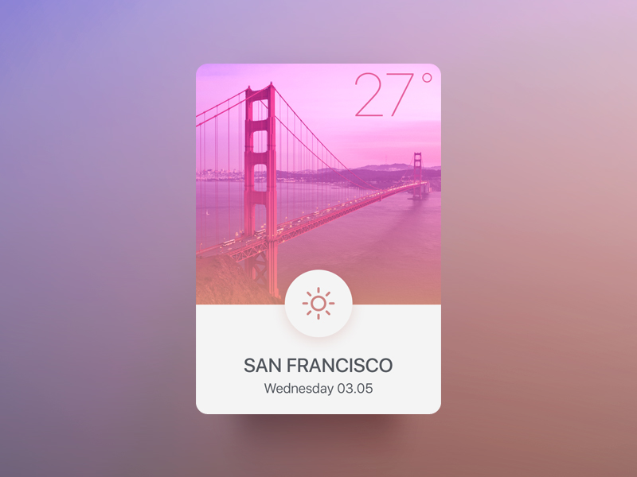

####Projet Perso n°2 : Application météo
===
  
### TODO 

- [ ] faire le front d'une application météo
- [ ] faire en sorte que l'UI/UX soit interressante 
	- [ ] identité visuelle
	- [ ] logo / police / couleurs / boutons
- [ ] choix des jours de la semaine ( lundi au dimanche)
- [ ] scrapping sur une API (météo france ou autre)
- [ ] choix des températures (AM - PM)
- [ ] gestion du hover ( animation: soleil/nuage/neige/pluie/etc..)

etc... à vous d'en ajouter